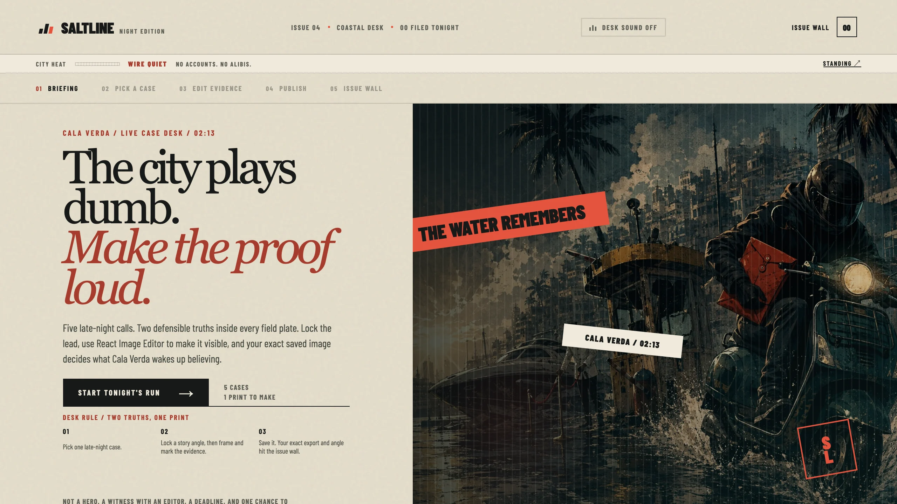
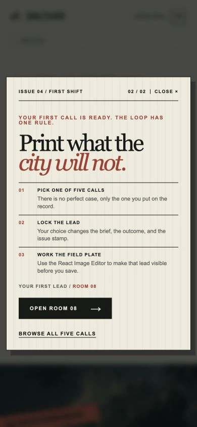
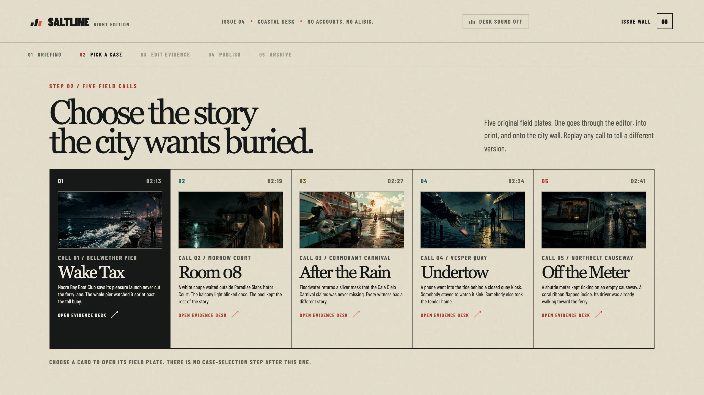
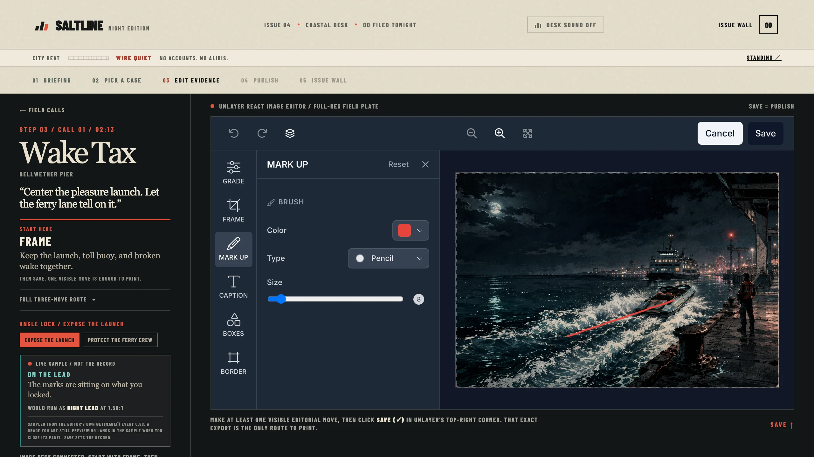
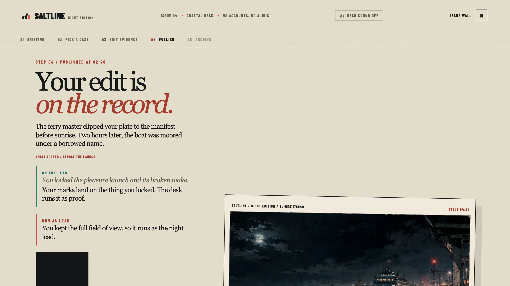
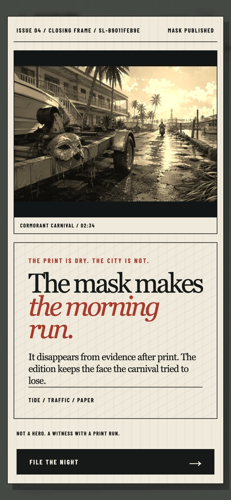
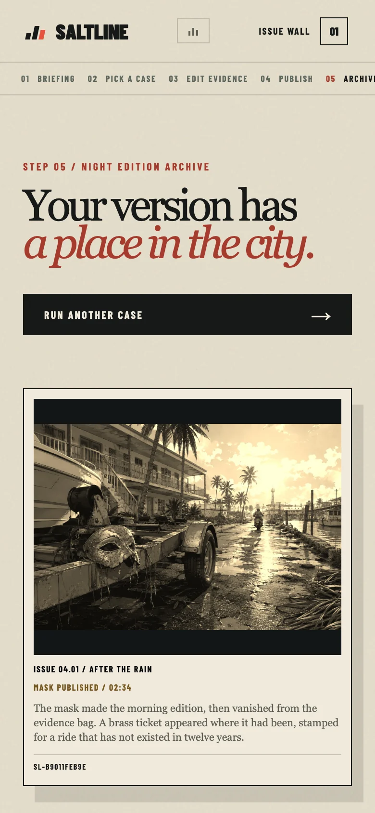

# Saltline Dispatch: the 2:13 AM edition

> Every night leaves a mark. Make it printable.

Saltline Dispatch is an original late-night coastal editorial micro-experience built for Unlayer's Build With React Image Editor Challenge. It answers the challenge's requested crime-game premise through the entirely fictional city of Cala Verda, an independent visual language, and original assets. You are the night-desk stringer: choose one field call, lock its editorial angle, work the source plate in React Image Editor, then save the exact result into the night edition.

[Live preview](https://saltline-dispatch.aditya-sarade2003.chatgpt.site) · [Public source](https://github.com/adityasarade/saltline-dispatch)

> Access note: the live preview remains owner-only until public launch is explicitly approved. The repository is public.


## The 3 to 5 minute loop

1. **Landing desk and first-shift guide:** Select **Start tonight's run** to open the two-step guide. Choose whether to follow a person or an object, then open the recommended call or browse all five.
2. **Field calls:** Choose exactly one of five original calls: Wake Tax, Room 08, After the Rain, Undertow, or Off the Meter.
3. **Angle Lock and editor:** Every call offers two editorial leads. Lock one, then work the original 1536 × 1024 same-origin field plate in React Image Editor with crop, filters, draw, text, shapes, stickers, or frames.
4. **Publish:** Select the editor's own **Save (✓)** control. Its returned `dataUrl` is the only publish path.
5. **Reveal, closing frame, and archive:** The exact flattened `dataUrl` appears in the publish reveal, the closing-frame overlay, and the session archive. Saltline's paper, stamp, and caption sit outside the exported pixels. Download uses that same export and its returned image format.

The five screens are landing desk, field calls, editor, publish, and archive. The first-shift guide and closing frame are overlays inside that flow. Removing React Image Editor removes the visitor-authored dispatch and breaks the central loop.

## Original coastal-crime direction

Cala Verda is a boomtown of marina money, roadside motels, carnival glare, ferry lanes, and disposable alibis. Saltline borrows only the challenge's broad tension between coastal spectacle and after-hours consequence. Its cases, places, copy, interface, and visual system are original. It does not recreate franchise scenes or use franchise characters, logos, maps, screenshots, trailers, leaked material, audio, or copied interface styling.

## Why React Image Editor is core

Saltline uses [`@unlayer/react-image-editor`](https://github.com/unlayer/react-image-editor) 1.0.2 as the in-world publishing desk. Every assignment begins with a same-origin original field plate. The visitor can crop, filter, draw, add text, place shapes or stickers, and frame the image. Angle Lock gives that freeform editing a story purpose by changing the brief, outcome, and issue stamp.

The editor's `onSave` result is the source of truth. The returned `dataUrl` is stored directly in local React state and rendered as the reveal, closing frame, archive item, and download. There is no alternate upload, mock artifact, or publish bypass. Saved-image pixels are shown with `object-fit: contain` and without CSS filters, grain overlays, captions, or stamps on top of them.

The feature configuration stays stable because changing editor features remounts the editor and discards work. The AI Assistant is not used, so the experience needs no API key, account, backend, or paid service.

## Performance and image delivery

Saltline preserves each original 1536 × 1024 PNG as the untouched same-origin source passed to React Image Editor. Display-only surfaces use measured WebP derivatives, keeping browsing light without reducing editable plate quality.

- Only the responsive landing hero loads eagerly and at high priority.
- The editor package is deferred until the editing screen opens.
- Five 768 × 512 call previews use native lazy loading and explicit dimensions.
- The selected full-resolution PNG begins loading on activation, in parallel with the editor runtime.
- A case-specific preview holds the stage while the full-resolution plate and editor load.
- Dynamic export frames reserve their layout and contain any crop ratio without hiding pixels.

| Surface | Before | After |
| --- | ---: | ---: |
| Landing hero | 3,361,867 B PNG | 160,582 B WebP at 768 px, or 583,562 B at 1536 px |
| All five call images | 15,317,149 B PNG | 431,592 B total WebP previews |
| Selected editor source | 2,798,020 to 3,177,871 B PNG | Unchanged original PNG |

The 768 px hero reduces encoded weight by 95.22%, while the five call previews reduce it by 97.18%. Repository bytes are shown above. Actual transfer depends on viewport, cache state, and which native-lazy previews enter the browser's loading threshold.

## Screenshots

| Night desk | First-shift guide |
| --- | --- |
|  |  |

| Five field calls | Angle Lock and React Image Editor |
| --- | --- |
|  |  |

| Exact saved reveal | Closing frame |
| --- | --- |
|  |  |

| Session archive |
| --- |
|  |

## Run locally

Requires Node.js 22.13.0 or newer.

```bash
npm ci
npm run dev
```

Open the local URL printed by the development server. React Image Editor loads its runtime from Unlayer's CDN, so the editing step requires network access.

## Verify locally

```bash
npm run lint
npm run build
```

The competition-readiness pass also exercises cold loads at 390 × 844 and 1280 × 720, horizontal overflow, both guide branches, Angle Lock, editor loading and recovery states, required Save, exact reveal-to-closing-to-archive identity, replay, and modal keyboard behavior.

## Stack

- React 19, TypeScript, Vinext, and OpenAI Sites
- Unlayer React Image Editor 1.0.2
- Local React state for the current session archive
- Same-origin 1536 × 1024 PNG editor sources
- Responsive WebP derivatives for display-only surfaces

## Originality and assets

Saltline is an unofficial, independent contest entry. It is not affiliated with or endorsed by any game publisher. It uses no franchise characters, logos, screenshots, trailers, leaked material, anime characters, real-brand marks, or unlicensed assets.

All assignment artwork and interface marks were created for this project. See [asset provenance](docs/asset-provenance.md).

## Repository notes

- The complete source needed to run the project is public.
- The React Image Editor implementation is visible in [app/page.tsx](app/page.tsx).
- Canonical field plates remain in `public/images` for same-origin canvas compatibility.
- Display derivatives live in `public/images/display` and are never passed to the editor.
- The project deliberately keeps five assignments and five screens. Its guide and closing frame remain overlays.
- There is no account system, backend, analytics, external API, or generated-story dependency.

## Challenge links

- [Unlayer React Image Editor](https://github.com/unlayer/react-image-editor)
- [React Image Editor docs](https://docs.unlayer.com/builder/latest/images/image-editor)
- [Build With React Image Editor Challenge FAQ](https://unlayer.notion.site/Build-With-Image-Editor-Challenge-FAQ-3cf0ceb4c8e180309d91cd730811ebd1?pvs=73)
