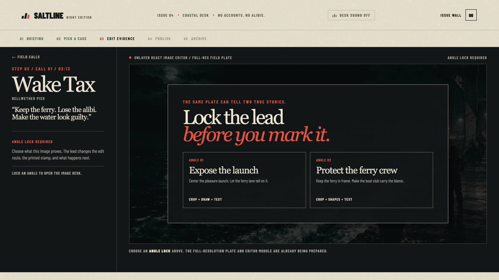

# Saltline Dispatch: the 2:13 AM edition

> Every night leaves a mark. Make it printable.

Saltline Dispatch is an original late-night coastal editorial micro-experience built for Unlayer's Build With React Image Editor Challenge. It answers the official prompt for a GTA VI-inspired experience by translating only its broad high-stakes coastal-crime premise into the entirely fictional city of Cala Verda, an independent visual language, original stories, and original assets. It does not reproduce franchise material or styling.

Five late-night calls arrive at the night desk. Every field plate contains two defensible truths. You choose which truth survives by locking an editorial angle, following its three-tool reporting route in React Image Editor, and saving the exact result into the night edition.

[Live preview](https://saltline-dispatch.vercel.app) · [Public source](https://github.com/adityasarade/saltline-dispatch)

> The competition build is publicly deployed on Vercel. The repository is public.


## For judges: the 60-second route

1. Select **Start tonight's run**, choose either desk instinct, and open the recommended call.
2. At **Angle Lock**, choose which of two defensible truths the field plate should prove.
3. Make a visible edit with the suggested React Image Editor tools, then use the editor's own **Save (✓)** control.
4. Compare the source and saved plate in the reveal, continue through the angle-specific closing frame, and open the issue wall.
5. Replay or download the archived dispatch. The plate code and exact saved pixels remain identical across every payoff state.

The key judging moment is the transition from Angle Lock to the editor and then to the printed reveal. It demonstrates that the editor is the story mechanic and the saved export is the artifact, not an optional utility attached to the experience.

## The 3 to 5 minute loop

1. **Landing desk and first-shift guide:** Select **Start tonight's run** to open the two-step guide. Choose whether to follow a person or an object, then open the recommended call or browse all five.
2. **Field calls:** Choose exactly one of five original calls: Wake Tax, Room 08, After the Rain, Undertow, or Off the Meter.
3. **Angle Lock and editor:** Every call offers two editorial leads. No angle is silently selected. Lock one, then use its custom three-tool route to work the original 1536 × 1024 same-origin field plate with crop, filters, draw, text, shapes, or frames. General-purpose stickers are deliberately disabled.
4. **Publish:** Select the editor's own **Save (✓)** control. Its returned `dataUrl` is the only publish path.
5. **Reveal, closing frame, and archive:** The exact flattened `dataUrl` appears in the publish reveal, the angle-specific closing-frame overlay, and the session archive. Saltline's paper, stamp, and caption sit outside the exported pixels. Download uses that same export and its returned image format.

The five screens are landing desk, field calls, editor, publish, and archive. The first-shift guide and closing frame are overlays inside that flow. Removing React Image Editor removes the visitor-authored dispatch and breaks the central loop.

## Original coastal-crime direction

Cala Verda is a boomtown of marina money, roadside motels, carnival glare, ferry lanes, and disposable alibis. Saltline borrows only the challenge's broad tension between coastal spectacle and after-hours consequence. Its cases, places, copy, interface, and visual system are original. It does not recreate franchise scenes or use franchise characters, logos, maps, screenshots, trailers, leaked material, audio, or copied interface styling.

## Why React Image Editor is core

Saltline uses [`@unlayer/react-image-editor`](https://github.com/unlayer/react-image-editor) 1.0.2 as the in-world publishing desk. Every assignment begins with a same-origin original field plate. The visitor can crop, filter, draw, add text, place shapes, and frame the image. Angle Lock gives that freeform editing a story purpose: each of ten possible leads changes the brief, suggested tools, outcome, stamp, and final closing line.

The editor's `onSave` result is the source of truth. An untouched Save is rejected through the editor instance's `hasChanges()` state, so the visitor must make an editor-detected move. The interface asks for that move to be clearly visible. The returned `dataUrl` is stored directly in local React state and rendered as the reveal, closing frame, archive item, and download. There is no alternate upload, mock artifact, or publish bypass. Saved-image pixels are shown with `object-fit: contain` and without CSS filters, grain overlays, captions, or stamps on top of them.

The same Save callback also uses Unlayer's returned `blob` to report honest export dimensions, MIME type, and encoded size. A short SHA-256-derived plate code, with a deterministic local fallback where Web Crypto is unavailable, makes the artifact's identity legible across reveal, closing frame, and archive without changing its pixels. Starting a new draft clears the active published artifact, and replaying the archive uses a dedicated path, so a previous dispatch can never masquerade as the new one.

The feature configuration stays stable because changing editor features remounts the editor and discards work. The AI Assistant is not used, so the experience needs no API key, account, backend, or paid service.

## Performance and image delivery

Saltline preserves each original 1536 × 1024 PNG as the untouched same-origin source passed to React Image Editor. Display-only surfaces use measured WebP derivatives, keeping browsing light without reducing editable plate quality.

- Only the responsive landing hero loads eagerly and at high priority.
- The editor package begins preloading only after a field call is selected and stays out of the landing bundle.
- Five 768 × 512 call previews use native lazy loading and explicit dimensions.
- The selected full-resolution PNG begins loading when its call is activated, while the visitor chooses an explicit Angle Lock.
- A case-specific preview holds the stage while the full-resolution plate and editor load.
- Dynamic export frames reserve their layout and contain any crop ratio without hiding pixels.

| Surface | Before | After |
| --- | ---: | ---: |
| Landing hero | 3,361,867 B PNG | 160,582 B WebP at 768 px, or 583,562 B at 1536 px |
| All five call images | 15,317,149 B PNG | 431,592 B total WebP previews |
| Selected editor source | 2,798,020 to 3,177,871 B PNG | Unchanged original PNG |

The 768 px hero reduces encoded weight by 95.22%, while the five call previews reduce it by 97.18%. Repository bytes are shown above. Actual transfer depends on viewport, cache state, and which native-lazy previews enter the browser's loading threshold.

## Screenshots

| Night desk | First-shift guide |
| --- | --- |
|  |  |

| Five field calls | Explicit Angle Lock |
| --- | --- |
|  |  |

| React Image Editor | Exact saved reveal |
| --- | --- |
|  |  |

| Closing frame | Session archive |
| --- | --- |
|  |  |

## Run locally

Requires Node.js 22.13.0 or newer.

```bash
npm ci
npm run dev
```

Open the local URL printed by the development server. React Image Editor loads its runtime from Unlayer's CDN, so the editing step requires network access.

## Verify locally

```bash
npm run lint
npm run build
```

The competition-readiness pass also exercises cold loads at 390 × 844 and 1280 × 720, horizontal overflow, both guide branches, explicit Angle Lock, untouched-Save rejection, real edits through all six enabled tools, editor loading and recovery states, exact reveal-to-closing-to-archive identity, stale-artifact prevention, archive replay, and modal keyboard behavior.

## Stack

- React 19, TypeScript, and Next.js 16 on Vercel
- Vinext and OpenAI Sites compatibility retained for local and private fallback builds
- Unlayer React Image Editor 1.0.2
- Local React state for the current session archive
- Same-origin 1536 × 1024 PNG editor sources
- Responsive WebP derivatives for display-only surfaces

## Originality and assets

Saltline is an unofficial, independent contest entry. It is not affiliated with or endorsed by any game publisher. It uses no franchise characters, logos, screenshots, trailers, leaked material, anime characters, real-brand marks, or unlicensed assets.

All assignment artwork and interface marks were created for this project. See [asset provenance](docs/asset-provenance.md).

## Repository notes

- The complete source needed to run the project is public.
- The React Image Editor implementation is visible in [app/page.tsx](app/page.tsx).
- Canonical field plates remain in `public/images` for same-origin canvas compatibility.
- Display derivatives live in `public/images/display` and are never passed to the editor.
- The project deliberately keeps five assignments and five screens. Its guide and closing frame remain overlays.
- There is no account system, backend, analytics, external API, or generated-story dependency.
- The evidence-based requirement matrix and final entrant actions are in [the competition audit](docs/competition-audit.md).

## Challenge links

- [Unlayer React Image Editor](https://github.com/unlayer/react-image-editor)
- [React Image Editor docs](https://docs.unlayer.com/builder/latest/images/image-editor)
- [Build With React Image Editor Challenge FAQ](https://unlayer.notion.site/Build-With-Image-Editor-Challenge-FAQ-3cf0ceb4c8e180309d91cd730811ebd1?pvs=73)
- [Official challenge submission form](https://docs.google.com/forms/d/e/1FAIpQLScfzk0EYvIZb9AuqI3A33H8dIk8WdlWPFNDz5S7TsaPrlVzVw/viewform?usp=send_form)
- [Submission kit with form answers and launch posts](docs/submission-kit.md)
