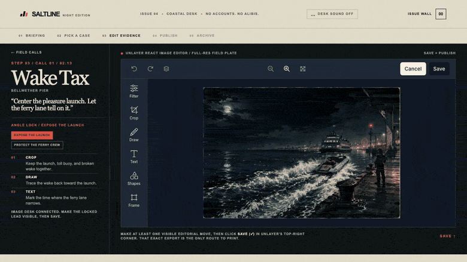

# Saltline Dispatch: the 2:13 AM edition

> Every night leaves a mark. Make it printable.

Saltline Dispatch is an original GTA VI-inspired late-night coastal editorial micro-experience built for Unlayer's Build With React Image Editor Challenge. You are the night-desk stringer for fictional Cala Verda, a boomtown of marina money, roadside motels, carnival glare, and disposable alibis. Choose one field call, shape its original field image with Unlayer React Image Editor, save the dispatch, then see that exact artifact enter the issue wall.



## The 3 to 5 minute loop

1. **Briefing:** learn the one objective: turn one late-night case into a published city dispatch.
2. **Pick a case:** choose Wake Tax, Room 08, or After the Rain.
3. **Edit evidence:** crop, filter, annotate, frame, and otherwise shape the original field image with React Image Editor.
4. **Publish:** use the editor's own **Save** control. The result is the image returned by the editor, not a mockup or a separate upload.
5. **Archive:** the saved image becomes the collectible dispatch in the session archive. It can also be downloaded as PNG.

The editor is indispensable: there is no publish bypass. Removing it removes the visitor-authored dispatch and the central before/edit/save/reveal loop.

## Original GTA VI-inspired direction

Saltline takes inspiration from the feeling of an open-city coastal crime saga: fake luxury beside real danger, a saturated waterfront after midnight, fleeting witnesses, and tabloid-scale consequences. Cala Verda, its cases, its places, its copy, and its visual language are original. The project deliberately does not recreate GTA VI scenes or use Rockstar, Take-Two, GTA, Vice City, trailer, leaked, or franchise assets.

## Why React Image Editor is core

Saltline uses [`@unlayer/react-image-editor`](https://github.com/unlayer/react-image-editor) 1.0.2 as the in-world publishing desk. Each assignment starts with a same-origin original field image. The user uses crop, filters, draw, text, shapes, stickers, and frames to produce a custom hot plate. `onSave` returns the edited `dataUrl`; the app immediately prints that image into the reveal and issue wall.

The editor's feature configuration is intentionally stable because changing features remounts the editor and discards edits. The AI Assistant is not used, so no API key, account, backend, or paid feature is required for the core experience.

## Run locally

```bash
npm install
npm run dev
```

Then visit the local URL printed by the development server. A deployed version also needs network access to Unlayer's image-editor CDN.

## Stack

- React 19, TypeScript, Vinext, and OpenAI Sites
- Unlayer React Image Editor 1.0.2
- Local React state for the current session archive
- Same-origin original PNG field images, avoiding canvas CORS failure

## Originality and assets

Saltline is an unofficial, independent contest entry. It is not affiliated with, sponsored by, or endorsed by Rockstar Games or Take-Two Interactive. It does not use GTA VI, Rockstar, One Piece, or other franchise characters, logos, screenshots, trailers, leaked material, audio, maps, visual assets, or copied UI.

All assignment artwork and interface marks are original to this project. See [asset provenance](docs/asset-provenance.md).

## Repository notes

- The complete source needed to run the project is public.
- The React Image Editor implementation is visible in [app/page.tsx](app/page.tsx).
- The field art is served from `public/images` so the editing canvas has same-origin inputs.
- The project deliberately has only three assignments and the five-screen flow. There is no account system, backend, analytics, external API, or generated-story dependency.

## Challenge links

- [Unlayer React Image Editor](https://github.com/unlayer/react-image-editor)
- [React Image Editor docs](https://docs.unlayer.com/builder/latest/images/image-editor)
- [Build With React Image Editor Challenge FAQ](https://unlayer.notion.site/Build-With-Image-Editor-Challenge-FAQ-3cf0ceb4c8e180309d91cd730811ebd1?pvs=73)
