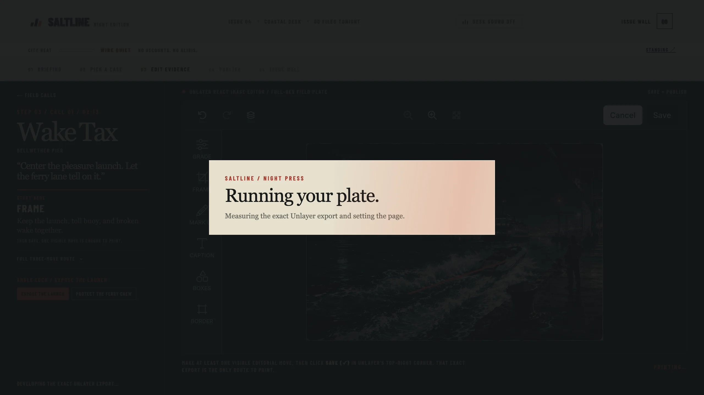
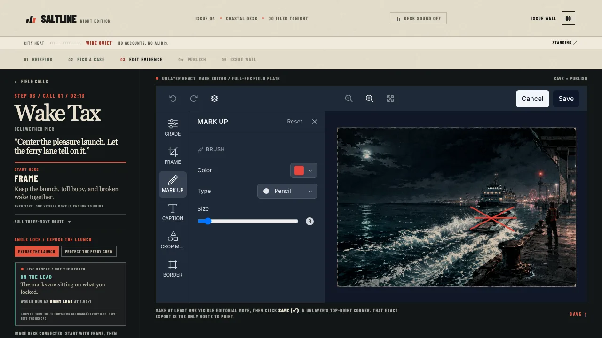
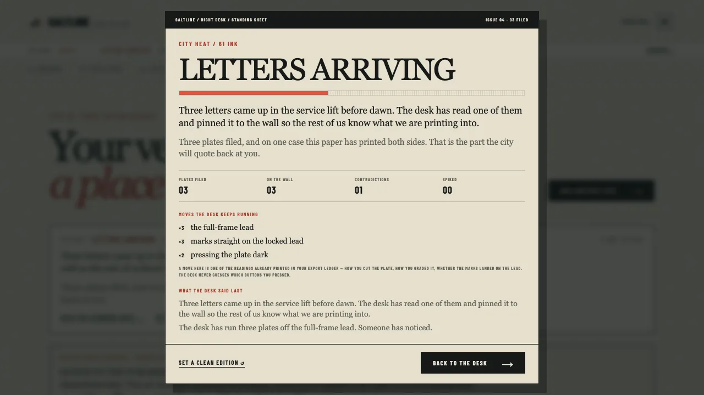
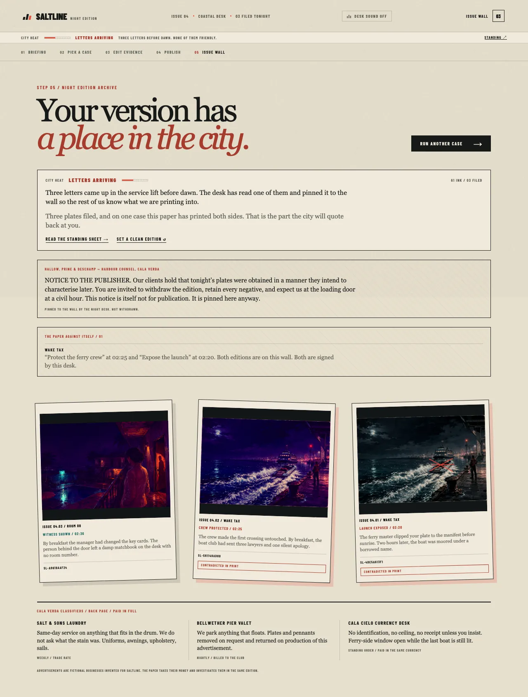

# Saltline Dispatch: the 2:13 AM edition

> Every night leaves a mark. Make it printable.

It is 2:13 AM in Cala Verda and you are the only reporter still awake. Five calls come in. Every field plate you get back can prove two different things, and both of them are true.

You pick which truth the city wakes up believing. Lock an editorial angle, work the plate in React Image Editor until that lead is visible, and hit Save. Whatever you saved is what goes to print - and the shape you cut it to decides how the front page runs it.

Built for Unlayer's Build With React Image Editor Challenge.

[Live preview](https://saltline-dispatch.vercel.app) · [Public source](https://github.com/adityasarade/saltline-dispatch)

> The competition build is publicly deployed on Vercel. The repository is public.


## For judges: the 60-second route

1. Select **Start tonight's run** and open any of the five field calls. The editor is three clicks from a cold load.
2. At **Angle Lock**, choose which of two defensible truths the field plate should prove.
3. Mark the subject your angle named — **MARK UP** on it, **CAPTION** it, **FRAME** to it. Watch the **live sample** card beside the canvas: it flips between *on the lead* and *off the lead* as you work, and tells you which front-page layout your current crop would produce. Then use the editor's own **Save (✓)** control. An untouched Save is refused.
4. Read the **lead call**, the **press call** and the **city heat** charge in the reveal. The desk has measured whether your marks landed on the thing you locked, what shape you cut the plate to, and what printing it cost you. Every reading is shown with the numbers it came from.
5. Download the front page. Its layout is chosen by your crop: a wide cut runs as a banner, a tight cut as a tall column. Then continue through the closing frame and open the issue wall.
6. **Now do it again, and print the other angle on the same case.** The paper runs two versions without reconciling its change in lead. Both plates are flagged, and city heat jumps. Reload the page: the wall, the heat and both versions are still there.

**If you only have thirty seconds:** lock an angle, scribble once directly on the subject it names, and Save. Then do the same case again and scribble on the sky instead. Same case, same angle, two different printed verdicts — from your pixels, not from a menu.

**If you have two minutes:** print both angles of one case. That is the thing only this concept can do.

The key judging moment is Angle Lock → editor → printed reveal. The editor is the story mechanic and the saved export is the artifact, not a utility bolted to the side of one.

## The 3 to 5 minute loop

1. **Landing desk:** Select **Start tonight's run** to reach all five field calls immediately. The three-step rule card on the landing page carries the orientation without an extra modal.
2. **Field calls:** Choose exactly one of five original calls: Wake Tax, Room 08, After the Rain, Undertow, or Off the Meter. The desk phone answers as the case opens.
3. **Angle Lock and editor:** Every call offers two editorial leads. No angle is silently selected. Lock one, then use its custom three-tool route to work the original 1536 × 1024 same-origin field plate with crop, filters, draw, text, shapes, or frames. General-purpose stickers are deliberately disabled.
4. **Publish:** Select the editor's own **Save (✓)** control. Its returned `dataUrl` is the only publish path. The night press run covers the real measurement work, then hands back a press read: your crop and brightness decide whether the page runs your plate as a banner, a lead, or a column.
5. **Reveal, closing frame, and archive:** The exact flattened `dataUrl` appears in the publish reveal, the downloadable 1600 × 2000 front page, the angle-specific closing-frame overlay, and the issue wall. Saltline's paper, stamp, and caption sit outside the exported pixels. The raw-plate download uses that same export and its returned image format.
6. **The night carries on:** the issue wall and the city heat are kept in the browser, so a second visit continues the same edition rather than restarting it. The masthead strip, the briefing, the wall and the closing frame all change as the heat rises, and there is an in-world button to pulp the run and set a clean edition.

The five screens are landing desk, field calls, editor, publish, and issue wall. The closing frame and the standing sheet are overlays inside that flow. Removing React Image Editor removes the visitor-authored dispatch and breaks the central loop.

## Original coastal-crime direction

Cala Verda is a boomtown of marina money, roadside motels, carnival glare, ferry lanes, and disposable alibis.

**What is borrowed is the register, and only the register:** a sun-bleached coastal boom town where crime is an industry; the satirical small-ad voice of businesses that are obviously fronts; and the pressure of attention — the idea that the more you do, the more the place notices, and that noticing has consequences. That last one is the direct ancestor of **CITY HEAT**, reinterpreted as a newsroom rather than a police response: an ink gauge on a masthead, a switchboard that starts ringing, a law firm at the loading door, an edition the desk is told to hold. There are no stars, no wanted level, and no police HUD anywhere in this build.

**Everything visible is original.** The city, the five cases, the ten angles, all narrative copy, the classifieds on the back page, the heat tiers and their notices, the fictional law firm, the interface, the typography, the palette and every image were made for this project. Saltline does not recreate franchise scenes and uses no franchise characters, place names, brands, logos, maps, screenshots, trailers, leaked material, audio, or copied interface styling. `npm run check:content` sweeps every line of authored copy against a list of 49 franchise and real-brand terms and fails the build on a hit, so this is checked rather than asserted.

Saltline is an unofficial, independent contest entry and is not affiliated with or endorsed by Rockstar Games, Take-Two Interactive, or any other publisher.

## Why React Image Editor is core

Saltline uses [`@unlayer/react-image-editor`](https://github.com/unlayer/react-image-editor) 1.0.2 as the in-world publishing desk. Every assignment begins with a same-origin original field plate. The visitor can crop, filter, draw, add text, place shapes, and frame the image. Angle Lock gives that freeform editing a story purpose: each of ten possible leads changes the brief, suggested tools, outcome, stamp, and final closing line.

The editor's `onSave` result is the source of truth. An untouched Save is rejected through the editor instance's `hasChanges()` state, so the visitor must make an editor-detected move. The interface asks for that move to be clearly visible. The returned `dataUrl` is stored directly in local React state and rendered as the reveal, closing frame, archive item, raw download, and front-page artifact. There is no alternate upload, mock artifact, or publish bypass. Saved-image pixels are shown with `object-fit: contain` and without CSS filters, grain overlays, captions, or stamps on top of them.

The same Save callback also uses Unlayer's returned `blob` to report honest export dimensions, MIME type, and encoded size. A short SHA-256-derived plate code, with a deterministic local fallback where Web Crypto is unavailable, makes the artifact's identity legible across reveal, closing frame, and archive without changing its pixels. Starting a new draft clears the active published artifact, and replaying the archive uses a dedicated path, so a previous dispatch can never masquerade as the new one.

The feature configuration stays stable because changing editor features remounts the editor and discards work. The AI Assistant is not used, so the experience needs no API key, account, backend, or paid service.

### The lead proof: did your marks land on what you claimed?

Locking an angle is a claim about **one subject in the photograph** — the pleasure launch, the witness on the balcony, the silver mask, the driver against the ferry lights. On Save, the desk checks whether your marks actually landed on it.

Each of the ten leads has a hand-authored region, read off the artwork and stored in [`lib/lead-regions.ts`](lib/lead-regions.ts). The saved export is compared against the untouched plate on a 256px grid, and two numbers come back: the share of pixels that moved **inside** that region, and the share that moved **everywhere else**.

| Result | What it means |
| --- | --- |
| **ON THE LEAD** | More than 1.5% of the region moved, and it moved more than the rest of the frame by a clear margin. The desk runs it as proof. |
| **WORKED WIDE** | The region moved, but so did everything else about equally — a global filter, say. The desk runs it, with a note. |
| **LEAD UNTOUCHED** | You edited the plate, but not the thing you locked. It still prints; the desk just says so. |
| **PLATE RECROPPED** | You recut the frame. A crop moves every pixel, so the comparison saturates and the desk refuses to report a number — it reads the cut instead. See the press read above. |

Both percentages appear in the export ledger next to the printed plate. Two visitors who lock the *same* angle on the *same* case get different verdicts if one marks the subject and the other marks the sky.

**The thresholds are measured, not guessed.** React Image Editor returns a re-encoded JPEG even when nothing was drawn, so a naive diff would report change everywhere. Re-encoding the five plates at quality 0.80–0.92 moves the 99.5th-percentile pixel by 9–22, which is why a pixel must move by more than 24 to count; that leaves the re-encode floor at 0.33% of pixels against a 1.5% decision line. A thin 8px stroke laid across the smallest region moves 3.0% of it. An earlier 4% threshold rejected exactly that stroke, which is how the number ended up where it is.

**What this deliberately does not do:** it does not understand your edit. It cannot tell a caption from a crop mark, it has no opinion about whether your mark is any good, and it knows nothing about the subject beyond a rectangle. It compares pixels in a box against pixels in the same box, reports both percentages, and says which way it read them. The logic is pure and covered by 16 tests in [`tests/lead-proof.test.mjs`](tests/lead-proof.test.mjs).

### CITY HEAT: the night remembers you

Saltline used to reset on refresh, which meant a judge who played twice got the same game twice. It does not any more.

The issue wall, the heat the desk has drawn, which leads and which measured moves you keep leaning on, and every case covered from both angles are kept in the browser under **one versioned key**, `saltline.desk.v1`. The logic is a pure module — no clock, no crypto, no DOM — in [`lib/city-heat.ts`](lib/city-heat.ts), covered by 42 tests in [`tests/city-heat.test.mjs`](tests/city-heat.test.mjs).

**Heat is charged for facts the desk already measured and already shows you**, itemised on the reveal:

| Charge | When | Cost |
| --- | --- | --- |
| A plate went to print | Every dispatch | **+8** |
| That lead was already on the wall | Relocking a lead you have printed | **+5**, then +8, +11 … |
| The desk reused a move it has run before | Per repeated *measured* move | **+3**, then +5, +7 … |
| The paper printed the other angle without reconciling its change in lead | Unreconciled coverage | **+18** |

A "move" here is not a guess about which buttons you pressed — React Image Editor does not report that, and guessing would be exactly the claim this project refuses to make elsewhere. It is one of the three readings already printed in your export ledger: how you **cut** the plate (banner / lead / column), how you **graded** it (pressed dark / straight / pushed for detail), and whether your **marks** landed on the locked lead. Reuse means the measurement came back the same, which is a fact, and the desk says so in those terms: *"The desk has run three plates off the full-frame lead. Someone has noticed."*

**Unreconciled coverage is the sharpest consequence, and it only exists here.** Every Saltline case has two defensible editorial leads; they are not necessarily opposite factual claims. Print one, then print the other without an editor's note, and the paper owes readers an explanation for its changed emphasis. Both plates are stamped **UNRECONCILED IN PRINT** on the wall, the case is named in an **UNRECONCILED COVERAGE** ledger with both angles and filing times, and it costs more than any repeat. The editor warns you before you file that second version.

**Four named tiers, and the heat changes what you see, not just a number:**

| Tier | From | Masthead strip | What appears |
| --- | --- | --- | --- |
| **WIRE QUIET** | 0 | `NO ACCOUNTS. NO ALIBIS.` | The quiet wire. Nothing pinned. |
| **SWITCHBOARD WARM** | 22 | `SWITCHBOARD: TWO CALLS, NO NAMES.` | The briefing and the wall report a car idling across from the loading door. |
| **LETTERS ARRIVING** | 48 | `THREE LETTERS BEFORE DAWN. NONE OF THEM FRIENDLY.` | A **legal notice** from Hallow, Prine & Deschamp — Harbour Counsel is pinned to the issue wall. |
| **EDITION HELD** | 78 | `HOLD THE EDITION. THE ORDER CAME FROM UPSTAIRS.` | The desk is told to hold the edition, a hold order is pinned, and **one plate already on the wall is spiked** — stamped, greyed, and no longer openable. |

Each tier owns its masthead strip, its briefing line, its wall copy and the line appended to the closing frame. The **standing sheet**, reachable from the masthead strip or the wall, shows the itemised standing, the leads you keep coming back to, the moves the desk keeps running, what the desk last said, and where the night is being kept. It is also where you **set a clean edition**, which erases the stored key and starts an empty wall.

**Storage is defensive by design.** Every access goes through a small injected-storage seam with a try/catch around it, and a private window or blocked site data degrades to an in-memory session with the desk saying so plainly — never an error and never a crash. A corrupt, truncated or future-schema payload is discarded rather than patched into a half state. Because a flattened export is 250 KB to 2 MB as a base64 data URL against roughly 5 MB of origin quota, the archive box keeps the **four most recent negatives** and every older record keeps its full ledger line with an honest `NEGATIVE NOT ON FILE` in place of its pixels; if the quota is hit anyway, the write ladder gives up negatives one at a time before it gives up the record. A worst-case 2.9 MB payload measured 5.8 ms to serialise and 6.9 ms to write, during the screen transition.

### The live sample: the desk answers while you work

The lead and press readings used to arrive only on Save, so the screen where a visitor spends most of their time said nothing back. A compact card now sits beside the canvas and updates while you edit: whether your marks are currently landing on the locked lead, and which front-page layout your current crop would produce.

It polls the mounted editor's own `getImage()` on an 800 ms interval, **gated on `hasChanges()`** and on the snapshot actually differing from the last one measured, so an untouched plate costs one boolean per tick and nothing else. One in-flight sample never overlaps the next, and the interval is torn down when the editor unmounts or the screen changes.

There is **no second measurement implementation**. The lead reading goes through `lead-proof.ts`'s own data-URL seam into the same `measureLead` on the same 256 px grid with the same `CHANGE_THRESHOLD`, `WORKED_SHARE` and `ASPECT_TOLERANCE`; the layout comes from `press-read.ts`'s own `classifyPlay`. The composition is one function in [`lib/live-read.ts`](lib/live-read.ts).

It is a **sample, not the record**, and the card says so: the authoritative reading is still the one taken from the Save result. Anything it cannot measure honestly it declines to report — a decode failure, a browser that will not release pixels, or the known trap where `getImage()` returns the *source URL* rather than an export before anything has been drawn. In every one of those cases the card simply is not there.

### The press read: your crop changes the page

Locking an angle decides what the story says. The edit itself decides how the story runs.

On Save, Saltline measures two things about your actual export and prints what they imply, the way a real night desk would:

| Measurement | What the desk does with it |
| --- | --- |
| **Aspect ratio** of the saved export | A wide cut (≥ 1.70:1, which includes a 16:9 crop) is promoted to a **banner** across the top of the page, headline underneath. A tight cut (≤ 1.20:1) is run as a tall **column** with the deck set alongside it. Anything between — including the untouched 1.50:1 plate — runs as the **night lead**. |
| **Exposure** against the plate you started from | The export's mean luminance divided by that plate's own measured baseline. Below 0.82× is filed as **PRESSED DARK**, above 1.22× as **PUSHED FOR DETAIL**, otherwise **STRAIGHT PRESS**. |

Exposure is deliberately *relative*. Every Cala Verda plate is a night scene with a baseline luminance between 0.11 and 0.37, so an absolute brightness threshold would only ever restate that the artwork is dark. Measuring against the plate you were handed means the press note reports what **you** did to it.

All three numbers — ratio, luminance, and exposure — are shown to you in the export ledger beside the printed plate, and the press call is stamped on the downloadable front page. Two visitors who lock the same angle on the same case get genuinely different pages if they cut or grade the plate differently, and the reason is disclosed rather than implied.

Saltline deliberately does **not** claim to understand your edit. It does not read your subject, your intent, or the quality of your work. It measures geometry and exposure, says so, and lays out the page accordingly. The logic is a set of pure functions in [`lib/press-read.ts`](lib/press-read.ts), covered by 13 tests in [`tests/press-read.test.mjs`](tests/press-read.test.mjs).

### Desk sound

The night desk has three short noises and no soundtrack: a call landing when you open a case, the press feeding a sheet when you Save, and a stamp coming down when the dispatch is filed. They are synthesized with WebAudio in [`lib/desk-sound.ts`](lib/desk-sound.ts), so the project ships no audio files and needs no audio licence. Sound is off until you turn it on from the topbar.

### The back page

The issue wall carries **Cala Verda classifieds**: ten original small ads for businesses that are obviously fronts, three at a time, turning over as the wall fills.

> **NACRE BAY BOAT CLUB** — Memberships available. Moorings, fuel, and a lane of open water at any hour. Discretion included.
>
> **MORROW COURT NOTARY** — Open 02:00 to 05:00. Signatures witnessed. Memories not. Two forms of identification accepted, neither of them checked.
>
> **OFFICE OF THE HARBOURMASTER** — Tonight's log is unavailable. Tomorrow's log is also unavailable. Enquiries regarding the log should be submitted in writing to the log.

Several of them are the same fronts the night's cases run through, because the paper sells ad space to the people it investigates in the same edition. That is the joke and it is also the premise. All ten are in [`lib/classifieds.ts`](lib/classifieds.ts), all invented for this project, and all swept by the originality check in `npm run check:content`.

## In-world tool names

The editor rail reads in Saltline's language through the documented `translations` option — `image_editor.tools.*` — so the dock says **FRAME**, **GRADE**, **MARK UP**, **CAPTION**, **BOXES** and **BORDER** instead of Crop, Filter, Draw, Text, Shapes and Frame. Each label is kept short enough to survive the rail's fixed width.

Two deliberate choices around it. **Save keeps its own name**, because the brief rail, this README and Unlayer's own documentation all say Save and the one control the whole journey depends on is not the place to be clever. And `translations` is set **once, before mount**, alongside `theme` and `locale` — the three keys the wrapper applies through `updateOptions` rather than a remount. `features` is on the remount path, so it is fixed and never touched: changing it would destroy the visitor's work.

[`lib/assignments.ts`](lib/assignments.ts) still stores Unlayer's own tool identities, so `npm run check:content` can keep proving that every authored route points at a tool that is actually enabled. `TOOL_NAMES` in [components/saltline/editor-stage.tsx](components/saltline/editor-stage.tsx) is the single place those identities become the words on the rail, so the brief and the dock cannot drift apart.

## Performance and image delivery

Each original 1536 × 1024 PNG stays as the untouched same-origin source handed to React Image Editor, so editable quality is never reduced. Every display-only surface - the landing hero and the five call previews - uses a measured WebP derivative instead, which takes the landing from 3.4 MB of PNG to about 0.8 MB total transfer.

Per-asset encodings, sizes, and encoder settings are in [asset provenance](docs/asset-provenance.md).

## Screenshots


| Five field calls | Explicit Angle Lock |
| --- | --- |
|  |  |

| React Image Editor, mid-edit | The night press run |
| --- | --- |
|  |  |

| Exact saved reveal and press read | Session archive |
| --- | --- |
|  |  |

| The live sample beside the canvas | The desk standing sheet |
| --- | --- |
|  |  |

The issue wall under city heat, with a pinned legal notice, a ledger of two angles on one case, and the classifieds on the back page. This capture predates the clearer *unreconciled coverage* wording now used in the UI:



The closing frame at phone width:


## Run locally

Requires Node.js 22.13.0 or newer.

```bash
npm ci
npm run dev
```

Open the local URL printed by the development server. React Image Editor loads its runtime from Unlayer's CDN, so the editing step requires network access.

## Verify locally

```bash
npm run lint
npm run test
npm run check:content
npm run build
npm run build:vercel
```

`npm run test` runs 87 unit tests with Node's built-in runner and needs Node 22.18+ for TypeScript import stripping. They cover the press-read play and tone classifiers, the lead-proof verdicts and their measured thresholds, the city-heat tier boundaries, repeat escalation, two-angle detection, determinism and its behaviour on corrupt, absent and over-quota stored data, the in-world clock including its wrap past midnight, and the export-metadata helpers — boundaries, determinism and the disclosed ledger lines included.

`npm run check:content` walks the authored content and fails the build if any case is incomplete: a missing plate or preview, an angle without a three-move route, a route naming a tool that is not enabled, a lead without an authored region, or a display derivative that has leaked into the editor path. It also sweeps every line of authored copy — the cases, the angles, the classifieds, the heat tiers and their notices — against 49 franchise and real-brand terms, and checks that the back page is complete and its rotation deterministic. A broken image in front of a judge is the one failure no unit test catches.

Everything else is **verified in a real browser**, driven end to end: cold loads at 390 × 844 and 1280 × 720, horizontal overflow on every screen, the editor reachable in three clicks, explicit Angle Lock, the live sample flipping between on-lead and off-lead from where the stroke actually lands, untouched-Save rejection, real edits through the enabled tools, persistence across a reload, two-angle coverage and its stamps, escalation through the heat tiers and the copy that changes with them, the spiked plate at the top tier, a clean edition, a blocked-`localStorage` session, the CDN-failure retry and its terminal state, and exact reveal-to-front-page-to-closing-to-wall identity — with zero console and page errors across the run.

## Vercel deployment

The public competition build runs at [saltline-dispatch.vercel.app](https://saltline-dispatch.vercel.app). `vercel.json` selects the native Next.js production build through `npm run build:vercel`. The existing Vinext build remains available for local and private fallback compatibility.

## Stack

- React 19, TypeScript, and Next.js 16 on Vercel
- Vinext and OpenAI Sites compatibility retained for local and private fallback builds
- Unlayer React Image Editor 1.0.2
- Barlow Condensed (SIL OFL 1.1) self-hosted through `next/font/google` for the uppercase desk furniture, with Georgia for the display serif
- React state for the live journey, with the issue wall and city heat persisted to `localStorage` under one versioned key
- Same-origin 1536 × 1024 PNG editor sources
- Responsive WebP derivatives for display-only surfaces

## Originality and assets

Saltline is an unofficial, independent contest entry. It is not affiliated with or endorsed by any game publisher. It uses no franchise characters, place names, logos, screenshots, trailers, leaked material, anime characters, real-brand marks, or unlicensed assets.

All assignment artwork, interface marks and written copy — including the classifieds, the heat tiers and the fictional Cala Verda businesses and law firm they name — were created for this project. `npm run check:content` enforces that automatically. See [asset provenance](docs/asset-provenance.md).

## Repository notes

- The complete source needed to run the project is public.
- The React Image Editor implementation is visible in [components/saltline/editor-stage.tsx](components/saltline/editor-stage.tsx): the code-split module load, the enabled tool dock, the error boundary, the Angle Lock gate, the loading plate, and the `<ImageEditor>` mount with every callback it uses.
- The five cases, their ten angles and all narrative copy are data in [lib/assignments.ts](lib/assignments.ts), so the story can be read without reading the app.
- What the desk can say about a saved export — the plate code, the extension, the size, and the in-world filing time — is a set of pure functions in [lib/export-meta.ts](lib/export-meta.ts), covered by [tests/export-meta.test.mjs](tests/export-meta.test.mjs).
- The cross-session consequence system — the issue wall, city heat, repeat escalation, two-angle detection, the four tiers, serialising and the storage seam — is a pure module in [lib/city-heat.ts](lib/city-heat.ts) with no clock, crypto or DOM in it, covered by [tests/city-heat.test.mjs](tests/city-heat.test.mjs).
- The live readout beside the editor is [lib/live-read.ts](lib/live-read.ts) (composition only, no thresholds of its own) and [components/saltline/live-read-card.tsx](components/saltline/live-read-card.tsx) (the gated poll).
- The Cala Verda classifieds are data in [lib/classifieds.ts](lib/classifieds.ts).
- [app/page.tsx](app/page.tsx) is the screen flow and state machine only.
- [app/globals.css](app/globals.css) is grouped in the order a visitor meets it, one declaration per line, with one block per breakpoint.
- Canonical field plates remain in `public/images` for same-origin canvas compatibility.
- Display derivatives live in `public/images/display` and are never passed to the editor.
- The project deliberately keeps five assignments and five screens. The closing frame and the standing sheet are overlays inside that flow.
- There is no account system, backend, analytics, external API, or generated-story dependency. The only stored state is one `localStorage` key on the visitor's own machine, which the standing sheet discloses and can erase.
- The evidence-based requirement matrix and final entrant actions are in [the competition audit](docs/competition-audit.md).

## Challenge links

- [Unlayer React Image Editor](https://github.com/unlayer/react-image-editor)
- [React Image Editor docs](https://docs.unlayer.com/builder/latest/images/image-editor)
- [Build With React Image Editor Challenge FAQ](https://unlayer.notion.site/Build-With-Image-Editor-Challenge-FAQ-3cf0ceb4c8e180309d91cd730811ebd1?pvs=73)
- [Official challenge submission form](https://docs.google.com/forms/d/e/1FAIpQLScfzk0EYvIZb9AuqI3A33H8dIk8WdlWPFNDz5S7TsaPrlVzVw/viewform?usp=send_form)
- [Submission kit with form answers and launch posts](docs/submission-kit.md)
